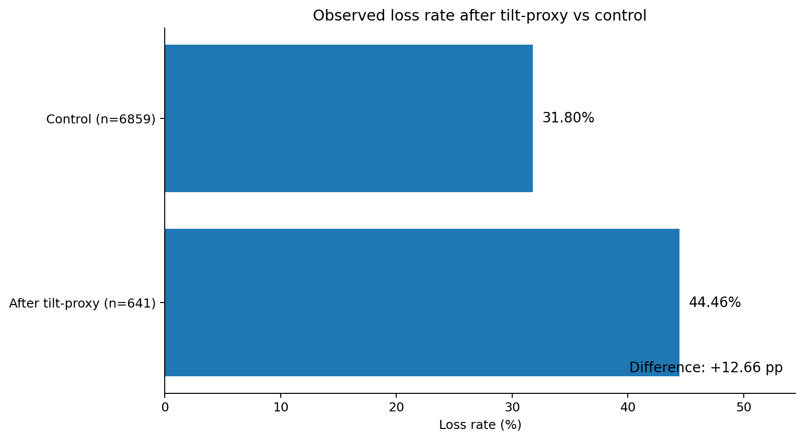
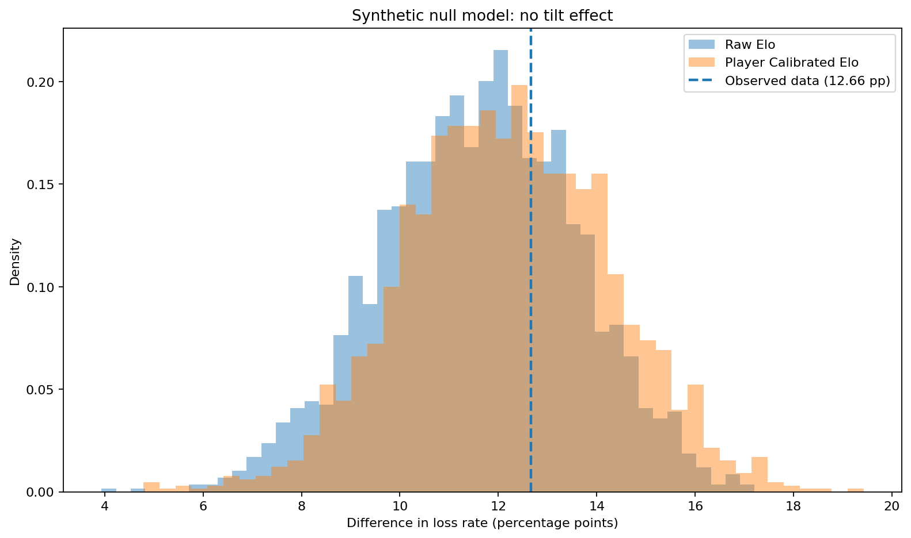
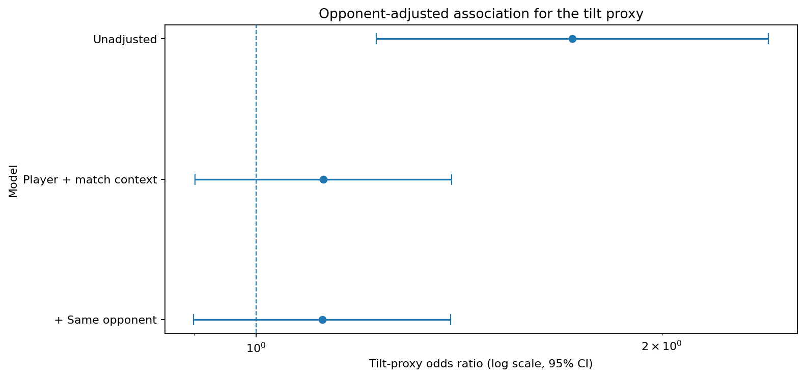
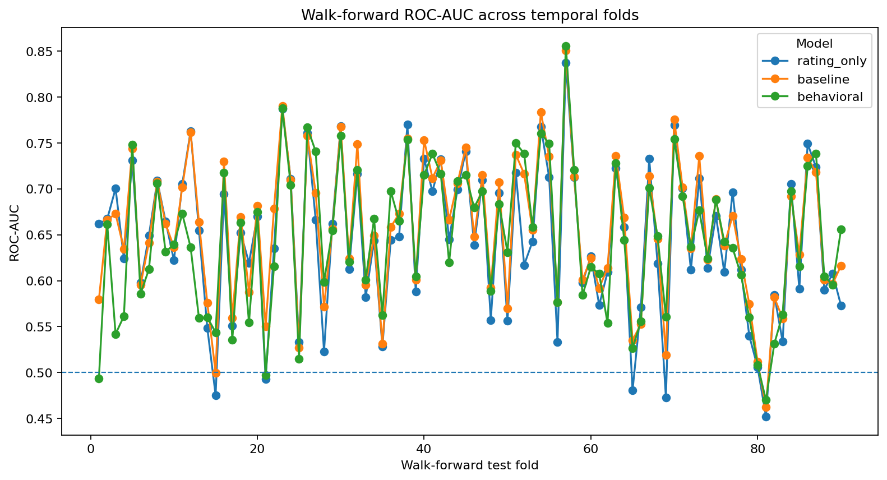

# Chess Behavior Analysis

## Research question

Does returning to play shortly after a loss, combined with a recent losing streak, relate to the outcome of the next **60+0 bullet** game on Lichess?

The project uses an operational **tilt proxy**:

```text
previous game = loss
AND
break <= 5 minutes
AND
recent loss streak >= 2
```

This is a behavioral proxy, not a direct measurement of psychological tilt.

---

## Data

The final analysis uses a pooled multi-player sample:

| Metric | Value |
|---|---:|
| Players | **15** |
| Unique games | **8,043** |
| Decisive games | **7,500** |
| Draws | **543** |
| Tilt-proxy observations | **641** |
| Control observations | **6,859** |

The sampling design uses `60+0` bullet games and a fixed temporal cutoff. Each selected player contributes their latest eligible decisive-game window, while all analyzable games in the corresponding window are retained, including draws.

---

## Main result

The raw next-game loss rate is higher after events classified by the tilt proxy:



**44.46% vs 31.80% · difference = +12.66 percentage points**

This is a descriptive association in observational data, not a causal estimate.

---

## Robustness: synthetic no-tilt simulation

The key question is whether a difference of this size requires an explicit behavioral effect.

To test this, decisive game outcomes are repeatedly generated from rating-based probabilities while preserving the observed structural setup, including player, opponent, rating, rating difference, color, order, timestamps, breaks, sessions, repeated-opponent structure and draws. The same tilt-proxy rule is then recomputed in every simulation.



Across **4,000 simulations**:

| Null scenario | Mean difference | 95% simulation interval | Simulations >= observed |
|---|---:|---:|---:|
| Raw Elo | **+11.62 pp** | +7.65 to +15.37 pp | **31.6%** |
| Player-calibrated Elo | **+12.18 pp** | +8.28 to +16.11 pp | **40.5%** |

The observed **+12.66 pp** lies inside both simulation distributions. Comparable differences therefore arise fairly often under these no-tilt outcome-generation models.

The reported tail share is an empirical simulation proportion, not a conventional p-value.

---

## Context-adjusted analysis

The raw association is then evaluated after accounting for match context and player effects.



| Model | Tilt-proxy OR | 95% CI | p-value |
|---|---:|---:|---:|
| Unadjusted | 1.717 | 1.228–2.400 | 0.0016 |
| Player + opponent context | 1.122 | 0.901–1.397 | 0.3028 |
| + same-opponent indicator | 1.120 | 0.899–1.395 | 0.3122 |

Cluster-robust standard errors use the **15 players** as the clustering unit.

After adjustment, the estimated association is much smaller and the confidence intervals include an odds ratio of 1.

### Interpretation

The main result is best read as:

**Observed association → Synthetic no-tilt check → Context-adjusted estimate**

The data show a raw **+12.66 pp** difference, but a comparable gap is common under the synthetic no-tilt models. After accounting for player and match context, the estimated association falls to approximately **OR 1.12**.

The evidence supports an observational association under an operational behavioral proxy. It does not identify a causal psychological “tilt” effect.

---

## Secondary analyses

### Player heterogeneity

The baseline association was also estimated separately for the 15 selected players as a secondary descriptive analysis.

- point estimates range from **−13.31 to +28.38 pp**;
- median estimate: **+12.01 pp**;
- 11 of 15 point estimates are positive;
- the number of tilt observations varies substantially across players.

These estimates are treated as heterogeneity rather than a ranking of players. Some player-level groups are small, so individual estimates can be imprecise.

### Predictive modeling

Predictive modeling is secondary to the main association analysis. Models use rating, game context and behavioral features and are evaluated chronologically.

| Model | ROC-AUC | Balanced accuracy | Log loss |
|---|---:|---:|---:|
| rating_only | 0.657 | 0.610 | 0.630 |
| baseline | 0.655 | 0.604 | 0.632 |
| behavioral | 0.646 | 0.603 | 0.629 |

For the 90-fold walk-forward evaluation:



| Model | Mean ROC-AUC | Mean log loss | Mean Brier |
|---|---:|---:|---:|
| rating_only | 0.644 | 0.642 | 0.227 |
| baseline | 0.655 | 0.642 | 0.226 |
| behavioral | 0.645 | 0.650 | 0.230 |

These metrics describe predictive performance. They are not causal evidence and are not the main research result.

---

## Limitations

- The design is observational. Association should not be interpreted as causation.
- The tilt proxy is a constructed behavioral rule, not a psychological measurement.
- The sample is restricted to `60+0` bullet games and is not representative of all Lichess users.
- Player-level estimates can be imprecise when the tilt group is small.
- Rating, opponent strength, time of day, game context and other unmeasured factors may confound the raw association.
- The synthetic null model tests a specific outcome-generation assumption. It does not reproduce every feature of real chess behavior.
- A future data collection may produce a different snapshot of the platform.

---

## Reproducibility

Create the environment and install dependencies:

```bash
python -m venv .venv
source .venv/Scripts/activate   # Git Bash on Windows
python -m pip install -r requirements.txt
```

Run the test suite:

```bash
python -m pytest -q
```

Run the multi-player research pipeline:

```bash
python -m src.pipeline multi --config config/config.yaml
```

The pipeline covers sampling, collection, parsing, feature engineering, statistical analysis, heterogeneity analysis, predictive modeling, synthetic null simulation and context-adjusted regression.

Raw multi-player data are cached locally when existing artifacts are sufficient for reproducibility.

---

## Project structure

```text
src/
├── collect.py
├── parse.py
├── features.py
├── research.py
├── sampling.py
├── stats.py
├── heterogeneity.py
├── model.py
├── v13.py
├── viz.py
└── pipeline.py

results/
├── sample_players.csv
├── sampling_candidate_pool.csv
├── sampling_metadata.json
├── player_summary.csv
├── player_tilt_effects.csv
├── multi_player_pooled_summary.csv
├── multi_player_data_quality.csv
├── player_heterogeneity.csv
├── player_heterogeneity_summary.json
├── synthetic_null_distribution.csv
├── synthetic_null_summary.csv
├── synthetic_null_summary.json
├── opponent_context.csv
├── opponent_adjusted_models.csv
├── opponent_adjusted_coefficients.csv
├── multi_player_model_metrics.json
├── multi_player_model_comparison.csv
├── multi_player_walk_forward_metrics.csv
├── multi_player_walk_forward_fold_metrics.csv
└── v13_analysis.md

figures/
├── pooled_tilt_effect.png
├── synthetic_null_distribution.png
├── opponent_adjusted_effect.png
└── walk_forward_roc_auc.png
```

Detailed outputs and the full statistical discussion are provided in `report.md`.
